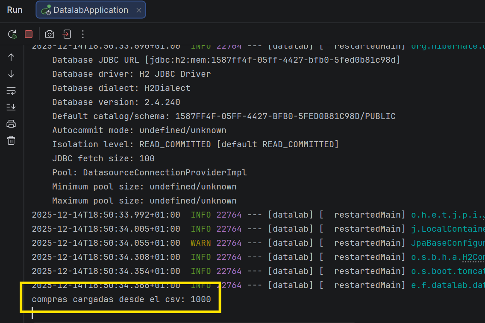

# 📊 Concurrent Programming – Feedback 01

Proyecto desarrollado como ejercicio de *feedback* para la asignatura de **Programación Concurrente**, utilizando **Spring Boot** como base para el procesamiento y carga de datos desde un fichero CSV.

El objetivo principal del ejercicio es simular un pequeño *data lab*, capaz de:
- Cargar datos desde un CSV.
- Transformarlos a objetos Java.
- Gestionarlos en memoria.
- Verificar el correcto funcionamiento mediante la ejecución de la aplicación.

---

## 🚀 Tecnologías utilizadas

- ☕ **Java**
- 🌱 **Spring Boot**
- 📦 **Maven**
- 🗄️ **H2 Database (en memoria)**
- 🧪 **Spring DevTools**
- 🧾 **CSV como fuente de datos**
- 🐙 **Git & GitHub**

---

## 🧩 Descripción de las partes del ejercicio

### 1️⃣ Modelo de dominio (`CustomerPurchase`)

Se ha creado una clase de dominio que representa una compra realizada por un cliente.  
Cada objeto de esta clase corresponde directamente a una fila del fichero CSV.

Incluye campos como:
- Identificador del cliente
- Producto
- Categoría
- Importe
- Fecha y hora
- Tipo de pago
- Región

Esta clase sirve como base para trabajar con los datos de forma tipada en Java.

---

### 2️⃣ Servicio de carga de datos (`CustomerPurchaseService`)

Se ha implementado un servicio encargado de:

- Leer el fichero CSV desde `resources`
- Procesar cada línea
- Convertir los valores a su tipo correspondiente
- Almacenar todas las compras en una lista en memoria

Durante el desarrollo se detectaron varios problemas importantes:
- Errores de conversión de tipos (`NumberFormatException`)
- Desajustes entre el orden real de las columnas del CSV y el código
- Problemas al interpretar correctamente fechas y valores numéricos

Estos errores se fueron corrigiendo revisando:
- El contenido real del CSV
- El índice correcto de cada columna
- El tipo de dato que debía parsearse en cada caso

---

### 3️⃣ Arranque automático del proceso (CommandLineRunner)

Para que la carga del CSV se ejecute automáticamente al arrancar la aplicación, se ha utilizado un `CommandLineRunner` definido como *bean*.

Este componente:
- Se ejecuta justo después de arrancar Spring Boot
- Llama al método `loadCsv()`
- Muestra por consola el número total de registros cargados

Esto permite verificar de forma inmediata que todo funciona correctamente sin necesidad de controladores web.

---

## 🧪 Resultado final de la ejecución

Tras corregir los errores detectados durante el desarrollo, la aplicación arranca correctamente y carga **1000 registros** desde el CSV.

📸 **Salida real por consola:**

Este resultado confirma que:
- El proyecto compila correctamente
- Spring Boot arranca sin errores
- El CSV se lee y procesa por completo
- Los datos quedan disponibles en memoria

---

## ⚠️ Problemas encontrados y soluciones aplicadas

- ❌ Errores al parsear valores numéricos  
  ✅ Solución: revisión del orden de columnas del CSV

- ❌ Excepciones durante el arranque  
  ✅ Solución: definición correcta del `CustomerPurchaseService` como *bean*

- ❌ Confusión inicial entre paquetes, servicios y dominio  
  ✅ Solución: reorganización clara del proyecto y separación de responsabilidades

---

## 🧠 Conclusiones

Este ejercicio ha servido para:
- Entender mejor la estructura de un proyecto Spring Boot
- Aprender a depurar errores reales de carga de datos
- Trabajar con ficheros CSV de forma controlada
- Comprender la importancia del orden y tipado de los datos
- Ver cómo pequeños errores pueden bloquear el arranque completo de una aplicación

El resultado final cumple con todos los requisitos del feedback propuesto y deja una base sólida para futuras ampliaciones, como persistencia real en base de datos o procesamiento concurrente.

---

## 👤 Autor

**Juan Manuel Torrado**  

---

✅ *Proyecto finalizado y verificado correctamente.*

